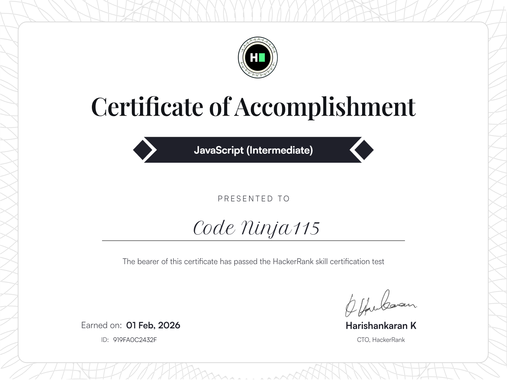

<h1 align="center">Hi 👋, I'm Yusif</h1>
<h3 align="center">A passionate Full Stack developer</h3>

## 🛠 Tech Stack

  

## 🏅 HackerRank Certificates
<table>
	<tr>
		<td>
			
		</td>
		<td>
			
		</td>
	</tr>
</table>  

## 🎯 Current Focus
- Front-end architecture and state management
- Building performant, accessible UIs
- Clean component design and reusable patterns

## 💼 What I Do
- Develop modern front-end applications with React and Vue
- Translate designs into responsive, high-quality UI
- Integrate front-end apps with REST APIs
- Collaborate across design and backend teams

## 📫 Contact
- GitHub: https://github.com/codeninja115
- Email: codeninja115@gmail.com
